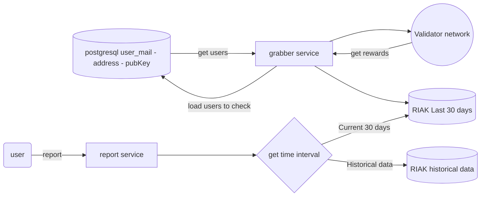

**DISCLAIMER** - i have not experience with configuration of aws, so calculation may contain mistakes.

---

Let's build system using `Know your data` approach.

## Data overview
As we show to user statistics of rewards for stacking his resources, there is only one connection need - `user` -> `rewards` in `epochX`, so we can use simple data storage.

### Data storage
Good candidate for this is `Riak` - distributed noSQL db with `Bitcask` engine and `Solr` integration.

This db simply append data to file and keep in-memory hash table with pointers to this data. For search in range - use LSM-tree.
So, we can easily get data from any time in past.

**Benefits**:
* append-only storage. data only append to file, no need to rewrite it - so compaction is not take lot of time.
* write amplification lover than in B-tree indexes

This db give us good perfomance for read|write operations and good scalability.

if we need get userX rewards for assetY in epochZ - we simply get hash of this concatenation and extract all object from storage
> bucket[userX _ assetY][epochZ]

### Data weight calculation
1. Assume that epoch duration is 10minutes

assume, that from validator we get reward list for user in epoch X is like:
```go
map[int64]int64{
    1667640738: 1000000000000000123, // epochID, reward
} 
```
> total size of such struct not less than `8 * 2 = 16 bytes`
> 
> key is epochID, so key-par is 16 bytes (pair is position in storage file, not reward)
> 
> 16 bytes per epoch, 144 keys-pairs per day, 4320 keys-pars per month.
> 
> 16 * 144 = 6912 bytes per day, 16 * 4320 = 207360 bytes per month (~200kb per month)
> 
> server with 8GB RAM can handle 41425 users per month for 1 asset

depending of business requirements, it can be compressed. Probably will be ok show changes per hour. 

In this case calculation different:
>  16 * 24 = 384 bytes per day, 384 * 30 = 11_520 bytes per month (~11kb per month), 720 key-pars per month
>
> server with 8GB RAM can handle 745_654 users per month for 1 asset


2. For epoch older that -4_320 epoch back (older than 1 month) - we can squash it to one object, so store changes per day, not per epoch.
> we store data for day, so we need 30 key pars per month
> (8 + 8) * 30 = 480 bytes per month
> server with 8GB RAM can handle 17_895_697 users per month for 1 asset for old data

so it will be something like:
```go
map[string]map[uint64]uint64{
    "user@mail.com_eth": map[uint64]uint64{
        "2022.11.04".Unix(): 1000000000000000123, // date, reward sum	
        "2022.11.05".Unix(): 1000000000000000123, // date, reward sum	
    },
    "user@mail.com_sol": map[uint64]uint64{
        "2022.11.04".Unix(): 1000000000000000123, // date, reward	
        "2022.11.05".Unix(): 1000000000000000123, // date, reward sum	
    },
}
``` 

### Summary
for scenario when we show report per every epoch on last month and aggregate to day for historical data:
1. we need minimum 8GB RAM for 41425 users per month for 1 asset
2. we need minimum `8 * 144 * 30 * 41425 = 1.5TB` storage for 41425 users per month for 1 asset
3. according to AWS calculation of Elastic Block Store (EBS) - it will cost ~331$ per month for 2TB storage and replication twice per day
4. we need also pay 134$ per month for 16GB RAM instance (t2.xlarge) of Riak

**total**: ~465$ per month for 41425 users per month for 1 asset (~930$ for eth and sol)

for scenario when we show stat per 1 hour:
1. we need minimum 8GB RAM for 745_654 users per month for 1 asset
2. we need minimum `8 * 24 * 30 * 745_654 = 2.8TB` storage for 745_654 users per month for 1 asset
3. according to AWS calculation of Elastic Block Store (EBS) - it will cost ~619$ per month for 4TB storage and replication twice per day
4. we need also pay 134$ per month for 16GB RAM instance (t2.xlarge) of Riak

**total**: ~753$ per month for 745_654 users per month for 1 asset (~1.5k$ for eth and sol)

all this calculation are without replication and without any optimization.

## An entity relationship diagram or object model
legend:
  
  * grabber - service that get data from validator about revards and store into riak hot db
    * grabber also compress data from `hot riak` to `historical riak`. It can be moved to separate service.
  * db - postgres db with data about users and assets. simply table like `user_mail|public_key|address|assets`
  * report service - service that get data from riak and postgres and build report for user



As result we need
* 1 postgres instance
* 2 riak instances
* 1 grabber instance 
* 1 report instance

```go
type Grabber interface {
    GetUsers() []address // get users from db, which staked resources and need get reward for 
    GetRewardFromValidators(address) map[int64]int64 // get rewards for user from validator
    // save rewards to riak. 
    // get rewards for today and append new walue to list for case when we show revards per hour
    SaveRewardToRiak(address, map[int64]int64) 
}
```

## Api methods
Based on previous stages, we can give such interface for get user rewards:
```go
type Asset string 

const (
    ETH Asset = "ETH"
    SOL Asset = "SOL"
)

type Reward struct {
    Date time.Time
    Amount uint64
}

type Client interface {
    // apply validation rules, like from-to can't be more than X days
    GetRewards(ctx context.Context, address string, asset Asset, from, to time.Time) ([]Reward, error)
}
```

## Describe briefly how you might build authentication for the web app.
1. Create jwt claim for user
2. Send request to sign this claim in wallet extension (aka Metamask) with `personal_sign`
3. Use generated signature to verify claim using account's public key. If it is valid - user is authenticated
4. Token has expiration time, so user need to re-authenticate after expiration (or re-new token base on refresh-token)